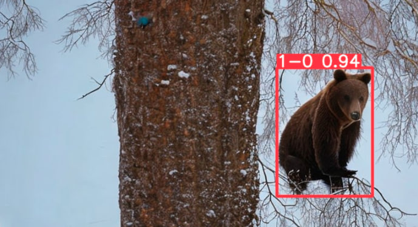
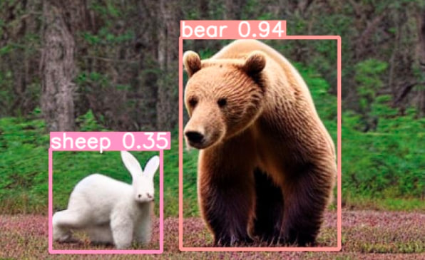
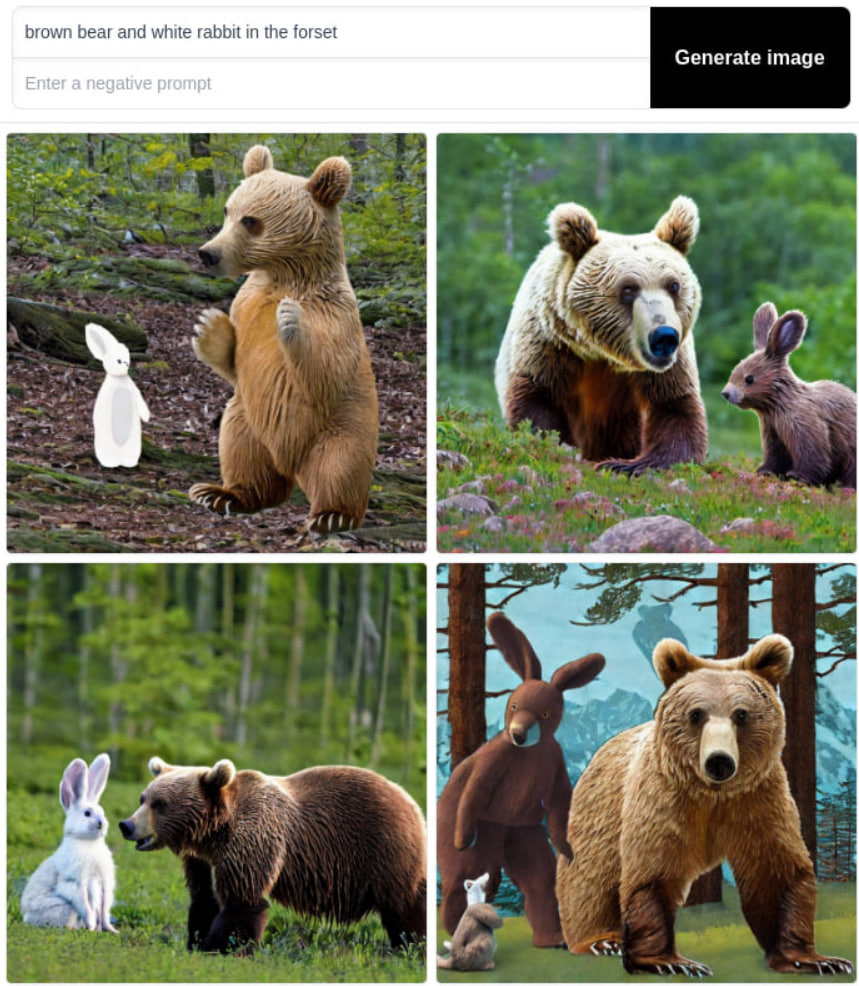
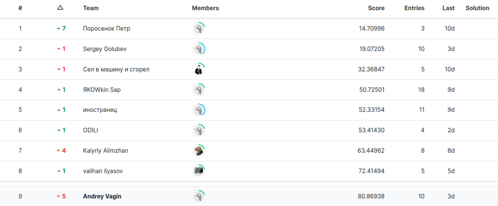

 

  

  <h1 align="center">Bears Detection</h1>

  

    Solution of Kontur's Kaggle competition on brown bears detection.
     
     
  

# Disclaimer

I have formulated the problem as follows: produce the model that generalizes on the training data as accurately as possible. Consequently, I **deliberately** did not annotate the test data to train on for the sake of consistency with the problem stated. This choice is motivated by my experience in industrial work, where the real data acts as "test dataset" and explicit annotations are not available for fine-tuning the model. Therefore, in my solution I used only the train data for training, validation, and testing, whereas 149 test images were used only for the final predictions. Although it seems that my approach influenced the final position on leaderboard drastically, I sincerely believe that you will appreciate my attitude and sportsmanship by focusing on the code quality and design of models.

 

# Method

* I decided to use **YOLO8** to solve competition as it is one of the best archtectures for object detections with convenient API to use.

* As first step I uploded given triaing data to the `RoboFlow`, added augmantations to it to extend the size of the dataset and exported it in the `ultralytics YOLO8` format. Pretrained model had pretty good success in detecting bears.

    

* So I created the [first version of the dataset](https://app.roboflow.com/aml-92lrc/bears-8v0yh/1) to try fine tune yolo for the given task. After `training 30 epochs` model showed **59.7 as the public score** and as I found out later **113.6 as the final score**. The process of the YOLO8 fine tuning and submission files creation can be found in [detection.ipynb](./notebooks/detection.ipynb).

* In the original dataset there were a lot of images without bears or with bears next to other other animals, so I decided to extend existing data. Our dataset was generated with Stable Diffusion, it means that images obtained there are from a completely different distribution than usual photos, so to keep things consistent I went to the [Stable Diffusion website](https://stablediffusionweb.com/#demo) and tried to generate pictures with bears similar to those present in the original dataset. Finally, [I generated 65 good examples](https://drive.google.com/drive/folders/1c1XLbw4x_rzCpegpHfJOVREq1A2FSXd8?usp=share_link) which I could use in further training.

    While generating I tried to simulate images from the original training data by requests like these: _bear with white hare, bear in the city, bear on the tree, bear in winter forest, bear under sky full of stars, bear in the mud, bear near the water and so on_. As we can notice **Stable Diffusion** is very specific when it goes to hares generation.

    

    After generating those images **I uploaded them into RoboFlow and annotated them by hands** and creacted the [second extended version of the dataset](https://app.roboflow.com/aml-92lrc/bears-8v0yh/2). I used it for further training, validation and testng.

    After dataset extension I fine tuned YOLO8 model during 30 epochs and got better results **46.8 public score** and **48.85 private score**.

* Then I came up with an idea how I can try to improve my solution. I decided to try to create a binary classifier which would decide whether there is a bear on the picture and only that pass the image to the YOLO. In file [data_preparation.ipynb](./notebooks/data_preparation.ipynb) you can find data preprocessing steps. I wanted to fine tune `PyTorch Inception model`, so I took training images and ones that I have generated by myself and formed `Torchvision ImageFolder` directory out of them. Then I fine tuned `Inception model` and obtained pretty good results: **1.0 accuracy on the test data**. For my purpose I needed maximum possible **recall** to not to miss any bear image and feed them all to the YOLO8, and high **precision** will be also grate. As accuracy was 1.0 both needed metrics are 1.0 either. The process of `Inception fine tuning` and obtained results can be found in the [classifier.ipynb](./notebooks/classifier.ipynb).

    The results were not so grate, as I found out later. Combination of Yolo8 and Inception gave me **85.0 public score** but **69.5 private score** which made me went from 4-th place to the 9-th. I assume that main problem here is that separation of test samples to public and private was not uniform, so my models ansamble did not generalize well on the private part testing set.

* Then I decided to try longer training. I trained YOLO8 model for 60 epochs and it gave me **34.988 for public part** and **80.869 for private part** which seemed to me as best result.

* Finally, when I chose the best model _(as I thought)_ I created [the third version of the dataset](https://app.roboflow.com/aml-92lrc/bears-8v0yh/3) with no testing part. I took 338 for train and 65 for validation. Validation part is needed for early stopping technique. Train samples were extended for 3 times with use of augmentations. I used this dataset for final training of YOLO8 for 60 epochs. 

    The results were the same with the previous trial **34.985 for public part** and **80.873 for private part**.

* As final thought I tried to train the model for `120 epochs instead of 60` and it gave the best result which I didn't choose as my final submission. **43.5 public** and **34.5 private**.

# Conclusion

Here are the results of the attempts I have described above:

| Trial | Private | Public |
|:-----:|:-------:|:------:|
| 1 | 113.59226 | 59.66918 |
| 2 | 48.85030 | 46.78957 |
| 3 | 69.47617 | 85.07403 |
| 4 | 80.86938 | 34.98757 |
| 5 | 80.87285 | 34.98489 |
| 6 | 34.53169 | 43.51819 |

I have chosen the 5-th submission as final one but it turned out that this model does not generalize well on the private data and, consequently, shifted my solution from the 4-th place to 9-th in the leaderboard. The best generalization of the data was obtained in the 2-nd and 6-th submissions for prolonged fine-tuning YOLOv8.

